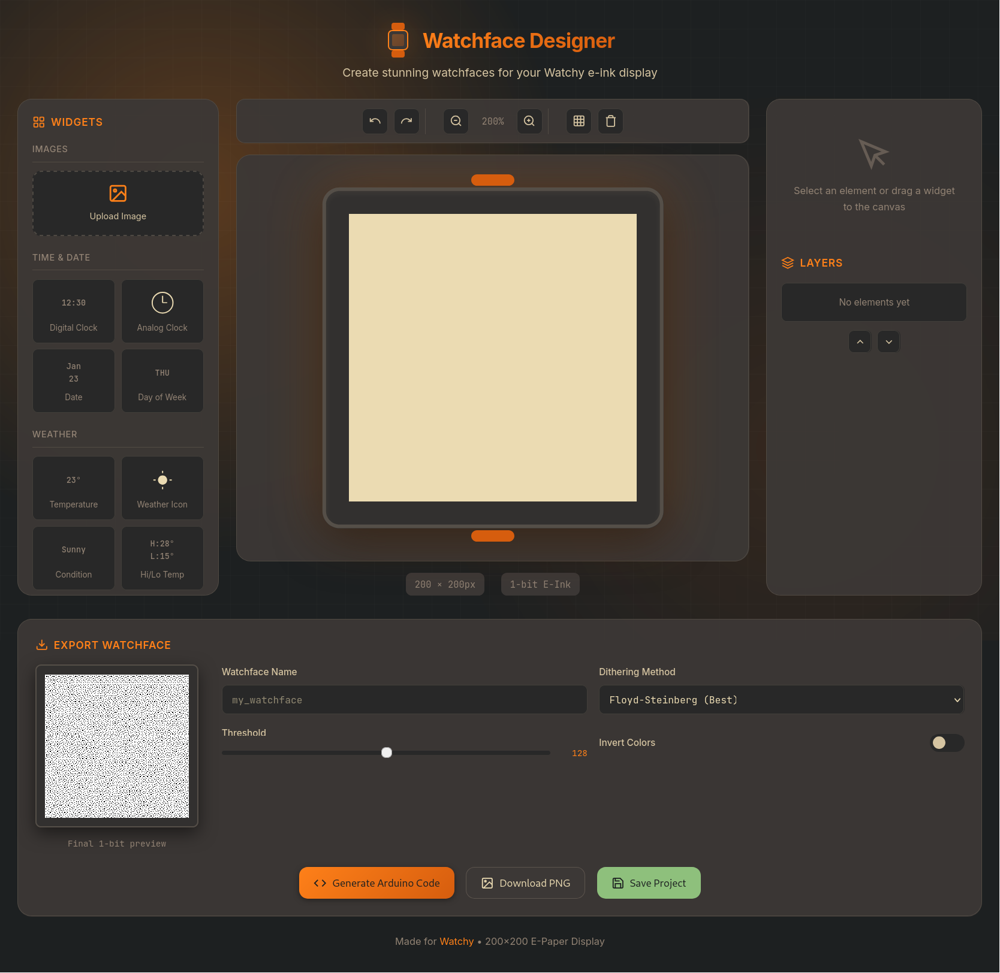

# Watchy Watchface Designer

A **Canva-like** web tool for designing custom watchfaces for the [Watchy](https://watchy.sqfmi.com/) e-paper smartwatch. Drag and drop widgets, upload images, and export Arduino-ready code!



## ✨ Features

### 🎨 Visual Design Canvas
- **200×200 pixel canvas** matching Watchy's e-ink display
- **Drag & drop widgets** from the widget library
- **Real-time preview** of your watchface design
- **Grid overlay** for precise alignment
- **Zoom controls** for detailed work

### 📦 Widget Library
- **Time & Date**: Digital clock, analog clock, date, day of week
- **Weather**: Temperature, weather icon, condition text, high/low temps
- **Status**: Battery indicator, step counter, WiFi, Bluetooth icons
- **Shapes**: Rectangle, circle, line, custom text
- **Images**: Upload your own images

### 🎛️ Element Properties
- **Position (X, Y)** - Precise pixel positioning
- **Size (Width, Height)** - Resize any element
- **Lock aspect ratio** - Maintain proportions while resizing
- **Font size** - Adjust text size (8-72px)
- **Stroke width** - Customize shape borders
- **Color** - Black or white (1-bit e-ink)

### 📚 Layers System
- **Layer ordering** - Move elements up/down
- **Visibility toggle** - Show/hide elements
- **Element selection** - Click to select from layer list

### 🔄 Undo/Redo
- Full history support with keyboard shortcuts
- Up to 50 undo steps

### 📤 Export Options
- **Arduino Code** - Ready-to-use C++ PROGMEM array
- **Raw Hex** - Direct bitmap data
- **Download .h file** - Header file for your project
- **Download PNG** - 1-bit image preview
- **Save Project** - JSON project file for later editing

### 🎨 Dithering Options
- **Floyd-Steinberg** - Best for photos and gradients
- **Atkinson** - Classic Mac-style dithering
- **Ordered (Bayer)** - Pattern-based dithering
- **No Dithering** - Simple threshold

## 🚀 Usage

1. **Open the Tool**: Simply open `index.html` in any modern web browser.

2. **Add Widgets**: 
   - Drag widgets from the left panel onto the canvas
   - Or click a widget to add it at center

3. **Customize Elements**:
   - Click to select an element
   - Drag to move, or use corner handles to resize
   - Adjust properties in the right panel
   - Use arrow keys for pixel-perfect positioning

4. **Manage Layers**:
   - Use the layers panel to reorder elements
   - Toggle visibility with the eye icon
   - Click layer names to select elements

5. **Export Your Watchface**:
   - Adjust dithering settings for best results
   - Click "Generate Arduino Code" to get the C++ code
   - Download the `.h` file for your Watchy project

6. **Add to Watchy**:
   ```cpp
   // In your Watchy project
   #include "my_watchface.h"
   
   display.drawBitmap(0, 0, my_watchface, 200, 200, GxEPD_WHITE);
   ```

## ⌨️ Keyboard Shortcuts

| Shortcut | Action |
|----------|--------|
| `Delete` / `Backspace` | Delete selected element |
| `Ctrl+D` | Duplicate selected element |
| `Ctrl+Z` | Undo |
| `Ctrl+Shift+Z` | Redo |
| `Ctrl+G` | Toggle grid |
| `Arrow keys` | Move selected element (1px) |
| `Shift+Arrow` | Move selected element (10px) |
| `Escape` | Deselect / Close modal |

## 🛠️ Tech Stack

- **Core**: HTML5, CSS3, Vanilla JavaScript
- **Styling**: Custom CSS variables, Gruvbox color palette, Glassmorphism effects
- **Canvas**: HTML5 Canvas API for rendering and image processing
- **Fonts**: Inter (UI) + JetBrains Mono (code/display)

## 📱 Browser Support

Works in all modern browsers:
- Chrome/Edge 80+
- Firefox 75+
- Safari 13+

## 📄 License

This project is open source and available under the [MIT License](LICENSE).

---

Made with ❤️ for the Watchy community
